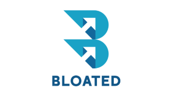

<p align="center">
  
</p>

<h1 align="center">Bloated</h1>

<p align="center">
  A Windows system utility toolkit built with Electron, React, and TypeScript.
</p>

---

## Features

### 🗑️ Cache Cleaner
- Scans **47 known Windows cache paths** (browsers, system temp, package managers, IDEs, etc.)
- Sort by size, name, or path — filter by category
- Configurable minimum file size threshold
- Delete to Recycle Bin or permanent delete
- Real-time scan progress with file count and total size

### 🦠 Virus Scanner
- **VirusTotal API v3** integration (hash-only lookups — no file uploads)
- SHA-256 hashing with 3-phase live progress: collecting → hashing → looking up
- Respects free-tier rate limit (4 requests/minute)
- Color-coded threat results with detection counts

### 🛡️ Security Audit
16 automated Windows security checks via PowerShell:
- Firewall status, Windows Defender status & signature freshness
- UAC level, Guest account, RDP, SMBv1, AutoPlay
- Windows Update configuration, open ports, network shares
- Auto-start programs, password policy, unquoted service paths
- BitLocker encryption, Secure Boot

### 🔌 Port Scanner
- TCP connect scan using Node.js `net` module
- **60+ known service names** with banner grabbing
- Configurable target, port range, timeout, and concurrency
- Presets: Quick (top 100), Common (1-1024), Extended, Full, Web, Database

### 📡 Network Scanner
- Ping sweep (TCP + ICMP) across a /24 subnet
- ARP table parsing for MAC addresses
- Hostname resolution via reverse DNS
- MAC vendor identification (Apple, Samsung, Google, TP-Link, etc.)
- Auto-detects local IP, subnet, and gateway

### 🔧 Dev Environment Checker
Health checks for 12 common dev tools:
- **Git** (global user config), **Node.js** (stale home node_modules detection), **npm**
- **Python** (pip, version), **Java** (JAVA_HOME, JDK vs JRE), **PHP** (Composer)
- **.NET SDK**, **Go** (GOPATH), **Rust** (cargo)
- **Docker** (daemon status), **Vite**, **VS Code CLI**
- **PATH health audit**: duplicate entries, nonexistent directories

---

## Tech Stack

| Layer       | Technology                          |
|-------------|-------------------------------------|
| Framework   | Electron 36                         |
| UI          | React 19 + React Router             |
| Language    | TypeScript 6                        |
| Bundler     | Vite 8                              |
| Icons       | Lucide React                        |
| Packaging   | electron-builder (NSIS + portable)  |

---

## Getting Started

### Prerequisites
- **Node.js** 18+ (LTS recommended)
- **Windows 10/11** (PowerShell required for security checks)

### Install

```bash
git clone https://github.com/tattooinmtl/bloated.git
cd bloated
npm install
```

### Development

```bash
npm run dev
```

This runs the Vite dev server, TypeScript watcher, and Electron concurrently.

### Build & Run

```bash
npm run build
npm start
```

### Package (.exe)

```bash
npm run pack
```

Outputs an NSIS installer and portable `.exe` in the `release/` folder.

---

## Configuration

- **VirusTotal API Key**: Enter in Settings page at runtime. Get a free key at [virustotal.com](https://www.virustotal.com/gui/join-us)
- **Delete Mode**: Recycle Bin (default) or permanent delete
- **Custom Cache Paths**: Add your own scan directories in Settings

---

## Security Model

- `contextIsolation: true` — renderer cannot access Node.js APIs directly
- `nodeIntegration: false` — all IPC goes through a secure preload bridge
- `sandbox: false` for preload (required for IPC)
- No remote code execution, no file uploads, no telemetry

---

## License

MIT
